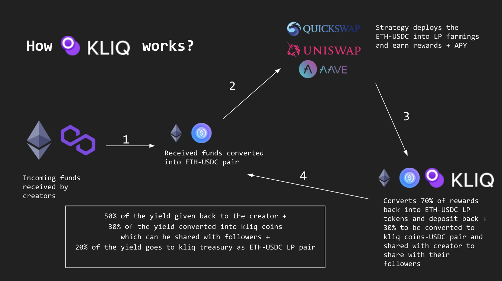

# kliq.club
Kliq gives creators and their communities a mobile first platform to create their own digital economy and grow together.

# Background
Web3 creates network effects say it is ENS community, NFT communities or DAOs. It creates borderless communities and allows inclusiveness in its structure. If you leave Instagram, Twitter or Tiktok today, you are going to leave your whole network of followers with the platform. Web3 changes this to take your network forward even if you want to leave the platform. We have built a solution to onboard web2 users into the web3 world without much hassle. 

kliq.club enables creators or freelancers to create and manage their own communities to collaborate with their fanbase in a more mutually beneficial way. Latest study says, in there are over 300M+ users who deals with crypto currency transactions. That will be the easier way to onboard the userbase. Creators who wants to get paid, can subscribe with the platform oAuth where they have their fan base and get a unique URL to get paid in Crypto. In addition to the funds received, the creators will get a guaranteed ~20% additional interest as well as benefits to their community.  

# How do you create your kliq club?
Create your own kliq club to enable transactions, access, and more innovative economic solutions directly on your mobile with zero knowledge on blockchain. 

1. Create your own kliq club
Onboarding creators with no prior technical knowledge and setup quick provisions to receive their funds into their own wallets. 

2. Build fan community
Receive funds in any crypto and encourage all your followers to join the community and reward them with coins or NFTs. Also share part of your yields with your loyal fan base. 

3. Benefits of owning coins
When your community holds kliq coin or your NFTs, provide them access to special groups/events, exclusive content, and tangible and digital rewards.

# How kliq works?
 Creators who wants to get paid, can subscribe with the platform oAuth where they have their fan base and get a unique URL to get paid in Crypto. The creator will share the unique kliq URL on their social media. The followers will pay by scannning the QR code from their crypto currency exchange apps in the form of ETH or Matic. The crypto that the creator receives will be kept under kliq community pool where kliq will generate additional yield on behalf of the creator. 

 
 
 Example:
 If a creator is paid $1000 worth of ETH,
 1. kliq will receive the ETH
 2. ETH will kept under yield farming in quickswap/aave/uniswap for the conversion into stablecoins(USDC/USDT)
 3. The creator can withdraw stablecoin anytime
 4. Creator will receive additional guaranteed yield of not less than 20%
 5. The yield will be split into 3 parts. 
    50% of the yield will go back to the creator. 
    30% of the yield will be converted to kliq coins which can only be shared with your follower community. 
    20% of the yield will be kept under kliq treasury

# Why kliq?
Kliq has no costs involved, doesn't require any crypto knowledge, and works flawlessly on mobile. Creators and their communities may cooperate in ways they never imagined possible with kliq, resulting in deeper, more meaningful connections.

 

